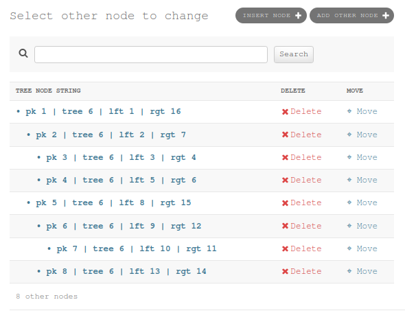
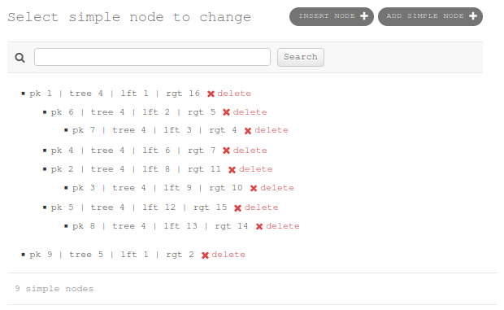
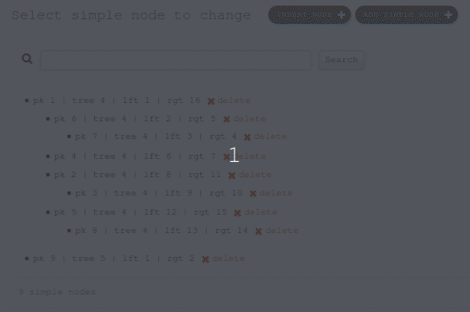
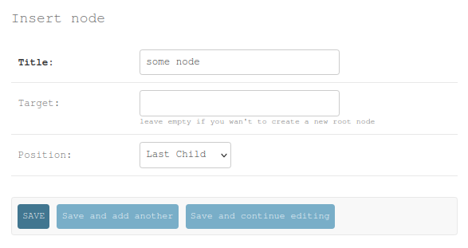
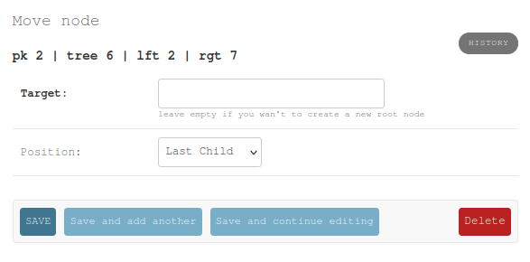

.. _admin:

Admin Sites
===========

There are two implementations to use with django admin.

Basically for both you had to register a model with that base classes to use it:

.. code-block:: python

    from django.contrib import admin
    from django.contrib.admin.options import ModelAdmin

    from mptt2.admin import MPTTDraggableModelAdmin, MPTTModelAdmin
    from mptt2.models import Tree

    from tests.models import OtherNode, SimpleNode

    admin.site.register(Tree, ModelAdmin)

    admin.site.register(OtherNode, MPTTModelAdmin)
    admin.site.register(SimpleNode, MPTTDraggableModelAdmin)

.. warning:: 
    For both the global delete multiple nodes in a queryset is disabled, cause this is not implemented for now. To delete a subtree click the delete button beside the node.

Simple Table Site
~~~~~~~~~~~~~~~~~

This admin site provides the default admin table without global delete function and a simple visible tree node depth indecation by using spaces.

   Simple table admin site

Draggable Admin Site
~~~~~~~~~~~~~~~~~~~~

This admin site provides a dragable tree view (no table) so simple editing the hierarchy of the tree by drag and drop the nodes.

   Draggable admin site

   Draggable admin usage example

Insert Node Form
~~~~~~~~~~~~~~~~

To insert a new node you can use the `insert node form`, which is available in the upper right corner or by using the relative link `/admin/%APP_LABEL%/%MODEL_NAME%/insert_at/`.

   Insert Node Form

It requires the `id` of the target node and the relative position where the new node shall be inserted at.

See :func:`mptt2.models.Node.insert_at` for details.

Move Node Form
~~~~~~~~~~~~~~

To move a node you can use the `move node form`, which is available in the move collum of the simple table site or by using the relative link `/admin/%APP_LABEL%/%MODEL_NAME%/<id>/move_to/`.

   Move Node Form

It requires the `id` of the target node and the relative position where the new node shall be inserted at.

See :func:`mptt2.models.Node.move_to` for details.
